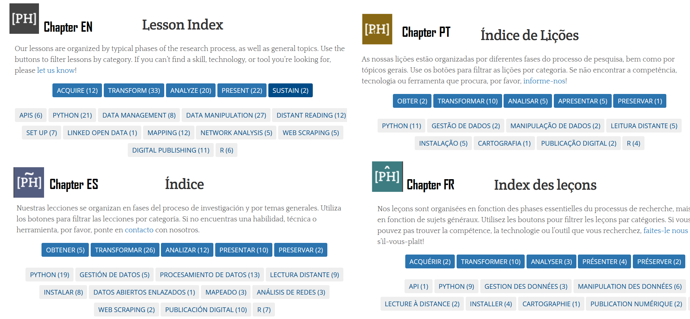
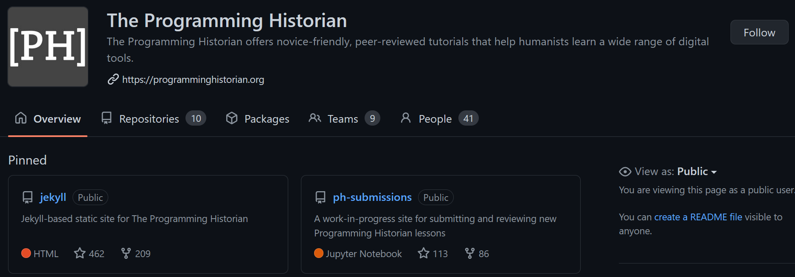

# Le programming historian { data-background-size="1000px" data-background-color="white"}

<p class="medpcenter"  style="margin-top:60px;margin-bottom:0px;">Revue méthodes en ligne <br> https://programminghistorian.org/</p>

<p class="medpcenter"  style="margin-top:60px;margin-bottom:0px;">Tutoriels pour l’appropriation des méthodes et outils numériques appliqués à l’histoire et autres SHS</p>

## Identité

<br>


<p class="medpcenter" style="margin-top:60px;margin-bottom:0px;">
<ul>
<li> 4 versions langangières à l’heure actuelle: EN, ES, FR, PT </li>
<li> Libre accès (modèle économique: diamond open access) </li>
<li> Licences libres CC-BY 4.0 </li>
<li> Evaluation ouverte par les pairs </li>
<li> Logiciels et technologies libres </li>
<li> Données ouvertes </li>
</ul></p>

## Leçons

### Chapitres linguistiques

<p class="medpcenter"  style="margin-top:60px;margin-bottom:0px;">181 Leçons -> 141 originales (toutes langues confondues)</p>


<p class="medpcenter" style="margin-top:60px;margin-bottom:0px;">
<ul>
<li> EN : 89 leçons depuis 2012 (toutes originales) </li>
<li> ES : 55 leçons depuis 2017 (traductions + 11 originales)  </li>
<li> FR : 21 leçons depuis 2019 (traductions + 2 originales)</li>
<li> PT : 23 leçons depuis 2021 (traductions) </li>
</ul></p>

## Leçons

### Organisation et indexation thématique

<br>

* Organisées pour intégrer l’une des phases de recherche: <br>Acquérir
    / Transformer / Analyser / Présenter / Préserver
* Indexation thématiques : <br> languages (R / Python) / données (gestion/manipulation) / Logiciels libres / Publications...
</p>

## Histoire


<br>

Programming Historian 1: 2007-2011 <br> William J. Turkel, Alan MacEachern

<p> “an open-access introduction to programming in Python, aimed at working historians (and other humanists) with little previous experience”

* William J. Turkel and Alan MacEachern, The Programming Historian 1st edition (Network in Canadian History & Environment: 2007-2008).

</p>

## Histoire

### Intertionalisation

<br>
<p>Programming Historian (EN) à partir de 2012 avec comité éditorial (revue)
<br>Internationalisation progressive (et rapide)
<br>
59 rédacteurs/rédactrices de 2012 à juin 2022 => comité editorial composé de volontaires & 
39 rédacteurs/rédactrices actuellement
</p>

## Evolutions et perspectives

<br>

<p class="medpcenter" style="margin-top:60px;margin-bottom:0px;">
* 2019: ProgHist Ltd. - association à but non lucratif<br/>=>
Partenariats institutionnels,<br/>=> soutiens individuels<br/>
* Depuis 2021: professionnalisation partielle avec embauche d’une assistante éditoriale <br> => vers un modèle mixte volontariat/externalisation</p>


## Une démarche 
<p>


</p>
* qui s’inscrit dans le libre et l’ouverture
* qui s’appuie sur une communauté
* qui promeut la diversité culturelle via le multilinguisme

# Lieu d'interactions et de collaborations { data-background-size="1000px" data-background-color="white"}

=> Travailler en humanités numériques : collaborations, complémentarités et tensions <br>


<p>
1. infrastructure
2. le PH comme communauté de pratique
3. multilinguisme
4. évaluation ouverte par les pairs
    
</p>

## 1. Infrastructure - évolutions

<p>[Programming Historian 1](http://niche-canada.org/wp-content/uploads/2013/09/programming-historian-1.pdf) (2007-2011): un simple document PDF en ligne </br>=> écriture linéaire, celle d’un livre imprimé mis en ligne
</p>
<p>
Programing Historian aujourd'hui:

* 2012-2015: WordPress
* 2015 --> GitHub


</p>


<br>
https://github.com/programminghistorian


## 1. Infrastructure - Pourquoi github ?

* Répondre aux besoins de l’équipe éditoriale: travail à distance, travail volontaire <br>==> temps individuels, différents fuseaux horaires… (cf. Blevins 2015)
* Gérer le volet international du PH et l’ajout de nouvelles équipes langagières <br>(cf. Lincoln 2020)
* Gérer le processus éditorial d’un nombre accru de leçons
* Gérer le côté social/technique du PH de manière transparente, ouverte et documentée :
tickets (issues) avec labels d’intérêt spécifique (selon équipe langagière et autres domaines ) 

<br>


## 1. Github - Outil de gestion éditoriale 

<br>
<p>
* Gérer le processus éditorial d’un nombre accru de leçons (versions et statuts des leçons) : 

  * dépôt ph-submissions pour la préparation des leçons: gestion des propositions acceptées, communication avec les auteur(e)s, organisation de l’évaluation ouverte par les pairs via des tickets (issues) publics (signalés dans les métadonnées yaml des leçons) à la place d’emails (sauf en cas d’évaluation fermée)
  * dépôt jekyll: publication et maintenance des leçons
</p>

## 1. Github - Outil de gestion éditoriale

<br>
<p>
* Gérer le côté social/technique du PH de manière transparente, ouverte et documentée :
  * tickets (issues) avec labels d’intérêt spécifique (selon équipe langagière et autres domaines: finance, lesson maintenance, technical…)
  * wiki avec documentation
</p>

## 2. Communauté de pratique


<br>

Lire le PH en tant que communauté de pratique selon (Wenger 1998)

* Domaine d’intérêt partagé
⇒ appropriation des méthodes numériques en SHS via l’autoformation

* Pratique de partage de ressources
⇒ tutoriels (connaissances, pratiques, données, expérience…)

* Engagement d’une communauté
⇒ équipe éditoriale (principes d’inclusivité, de parité)
⇒ contributeurs / contributrices: auteur(e)s, évaluateurs/évaluatrices, traducteurs/traductrices
⇒ soutiens, partenaires (==> évolution vers un modèle mixte avec externalisation/rémunération de certains services)


## 2. Communauté de pratique
### Programming Historian en français


* 43 contributeurs / 21 leçons
<br><br>
* Une concentration géographique autour de centres universitaires : 
  * Paris (Ecole des Chartes / Sorbonne / Versailles) / Lyon (ENS & ENSIB) / Lille / Bordeaux
  * Plusieurs institutions de recherches  (ENS / LARHRA / CNRS / INRIA )
<br>

* 2 leçons originales : 
<br><br>


* de nouvelles leçons arrivent !


## 2. Communauté de pratique
### Fréquentation géographique du site

<p> GAnalytics pour juin 2021-juin 2022 
- 875 451 utilisateurs uniques (1 137 093 sessions)</p>


<br><br>

|       Pays         |   Nombre d'utilisateurs uniques     |
| -------------- | ------ |
| USA  | 140621 |
| Inde          | 102387 |
| Espagne          | 63993  |
| Mexique         | 52057  |
| Colombie       | 46692  |
| France         | 36445  |
| UK | 36350  |
| Allemagne        | 27057  |
| Argentine      | 25462  |
| Chili          | 25377  |

## 3. Multilinguisme - traduction

Travail éditorial considérable autour de :

* ressources bibliographique reliées (hyperliens, références bibliographiques, notes) 
* données
* traduction du code (question éternelle: jusqu'où doit/peut-on aller?)


<br><br>

* Jusqu'à maintenant depuis l'angle EN vers les autres langues
* Depuis 2022, traductions ES=>EN, FR=>EN, ES=>PT <br> début d'une tendance inverse? 
</p>


## 4. Evaluation ouverte par les pairs


* PH est attaché aux principes de l'évaluation ouverte par les pairs, un modèle de validation du savoir scientifique qui se répand de plus en plus dans le monde académique. 

* Excepté demande du ou de l'autrice de la leçon de passer par une évaluation non publique (demande très rare et que PH n'encourage pas), l'intégralité du processus de révision du texte de la future leçon est disponible en accès libre via une issue github, qui est la meilleure solution technique trouvée par PH, comme vu plus haut. (DIAPO, capture).

## 4. Evaluation -interet de la démarche


* garantir un processus d'évaluation correct et courtois pour toutes les parties
* valoriser le travail de toutes les parties ayant pris part à la production de la leçon: auteur/ice, mais aussi éditeur/ices et évaluateur/ices. 
* éventuellement d'un point de vue interne, servir de base pour les futures leçons et construire une identité scientifique et éditoriale au fur-et-à-mesure de la création de nouvelles leçons.


## 4. Processus: 

1. soumission à comité qui accepte ou pas (ensemble des éditeur/ices)
2. acceptation avec conseils de modification
3. allers-retours entre évaluateurs/ices et auteur/ice
4. l'éditeur a tendance à synthétiser les retours des evaluateurs pour faciliter la correction de la leçon
5. publication finale


## 4. Processus - issues github (1)


## 4. Processus - issues github (2)


# Retour d'experience { data-background-size="1000px" data-background-color="white"}
<br>

## Célian Ringwald - janvier 2021

* 1 revue (Beautifull soup)
* 2 éditions (Passim / tf-idf)
* 1 traduction en cours (Open Linked Data)
* 3 traductions en attentes (tutoriel bases)
<br><br>

* Remarques :
  * De la difficulté à traduire les termes techniques
  * Concilier les acceptations linguistiques
<br><br>
* Demande de se libérer du temps (activité bénévole)
<br><br>
* Pour aller plus loin : analyse des contributions
<br><br>

# Rejoingnez-nous !
<p> Si vous souhaitez rejoindre la communauté vous êtes les bienvenus !
<br>https://programminghistorian.com
@ProgHist
</p>

* Ecrire une leçon
* Assurer le suivi éditorial d'une leçon
* Traduire une leçon

# { data-background-size="1000px" }

Thank you!
¡Gracias!
Merci!
Obrigada!

```{r, echo=FALSE, eval=TRUE}


```  
  
